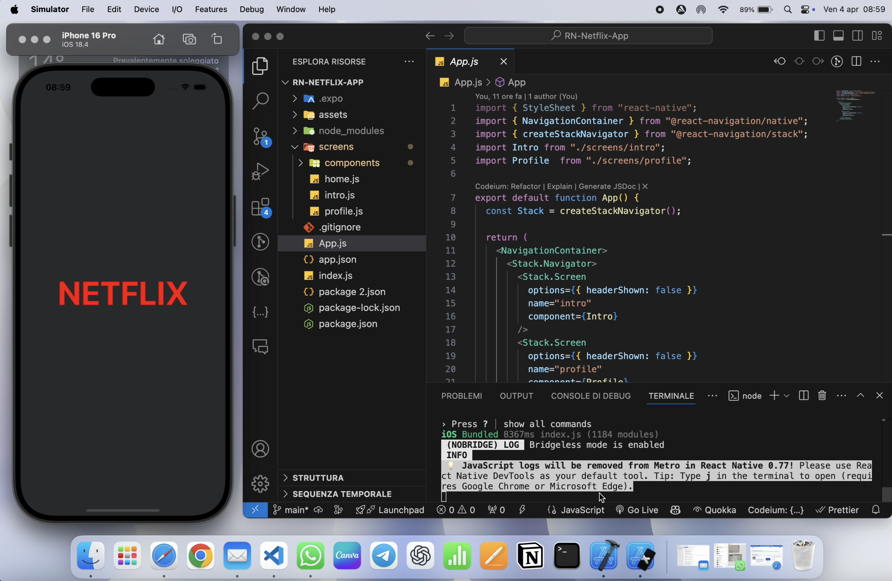

# Netflix Clone - React Native

A simple **Netflix app clone**, developed with **React Native** to practice key mobile development features.



## 🚀 Features Implemented
- **Intro screen** with animation
- **Profile management**: add, select, and delete profiles
- **Netflix-inspired UI**, with a clean and responsive design

## 🔧 Technologies Used
- **React Native**
- **Expo** for fast development and testing
- **React Navigation** for screen management
- **Animated API** for smooth animations

## 📌 Next Steps
- Implementing the main screen with content display
- Adding scroll effects and advanced transitions
- Integrating with APIs to fetch real data

## 📂 Installation
```sh
# Clone the repository
git clone https://github.com/giacomomontepino/Copy-of-Netflix.git
cd netflix-clone

# Install dependencies
yarn install  # or npm install

# Start the development server
expo start
```

## 📩 Feedback
Any suggestions or feedback are welcome! If you have ideas to improve the app, feel free to contribute. 🚀

